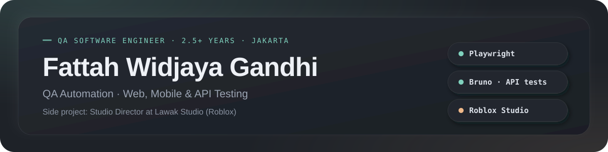
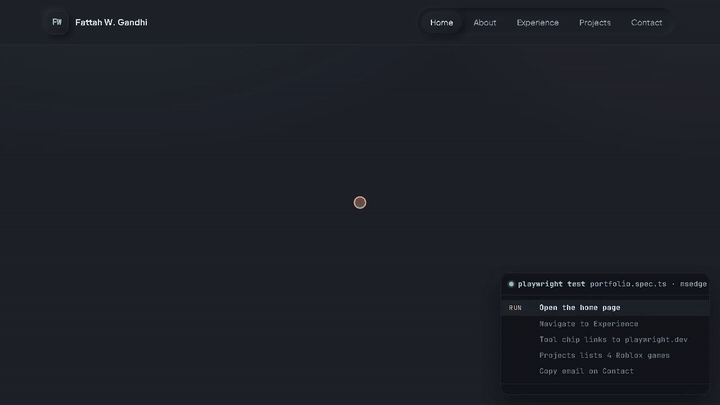

  

  
  
  

## About

I'm a QA Software Engineer in Jakarta with 2.5+ years of testing banking, insurance, and enterprise applications:
SIT, UAT, regression, API, and performance testing. I've automated with UFT One at work and with Selenium, Serenity BDD,
Rest Assured, and Appium in Java, and now I build with Playwright and Bruno in CI.

On the side, I'm Studio Director at Lawak Studio, where I lead small Roblox game projects.

## What I do

**Quality engineering (main career)**

- Own QA on projects as the independent tester: test planning, test case design, SIT, UAT, regression, and defect
  validation, together with development and business teams.
- Test web and mobile applications, test APIs directly, and run performance tests with JMeter.
- Build and maintain test automation: UFT One at work, and Playwright and Bruno in my public suite.

**Working alongside AI: Claude Code and GitHub Copilot**

I don't hand my testing over to AI. I set up how the agents work with me, and they speed up the repetitive parts:

- **I write the rules.** Each project gets instructions for the agent: which environments it may touch, which data
  it may change, how to name test cases, and when it must stop and ask me.
- **The test case is the source of truth.** An agent may fix a selector or a wait, but it may never change an
  expected result just to make a test pass. If the app differs from the test case, that's a finding for me to report.
- **I review every change.** Agents draft test cases, Playwright and Bruno scripts, and run summaries. I read the
  diff, run the tests, and make the final call.

My [Automations Test Preset](https://github.com/FattahWG/Automations-Test-Preset) shows these rules in practice.

## Featured work

| Project | What it shows |
| --- | --- |
| [Portfolio test suite](https://github.com/FattahWG/fattahWG.github.io/tree/main/tests) | Playwright end-to-end, axe accessibility, and phone-layout tests, plus a Bruno HTTP collection. GitHub Actions runs them on every push, and a failing test blocks the deploy. Reports: [Playwright](https://fattahwg.github.io/qa-report/), [Bruno](https://fattahwg.github.io/qa-report/api). |
| [Portfolio](https://fattahwg.github.io/) | The site under test. Built with Astro, with clean URLs and a recorded run of the smoke test. |
| [Automations Test Preset](https://github.com/FattahWG/Automations-Test-Preset) | A workflow preset, not a framework: setup guides, test case structure, reporting conventions, and the rules AI agents follow. |

**Earlier automation (Alterra Academy QA bootcamp, Java):**
[REST API tests with Serenity BDD and Rest Assured](https://github.com/FattahWG/ALTA-Serenity-Rest-QE7-FattahWidjayaGandhi) ·
[Android tests with Appium](https://github.com/FattahWG/MobileAutomation-ALTA) ·
[Pet Adopter capstone, API and web](https://github.com/FattahWG/Petadopter-QE7-ALTA) ·
[Web tests with Selenium and Cucumber](https://github.com/FattahWG/Automation-on-website-saucedemo)

  
   
  A real Playwright run: five smoke-test steps on my portfolio, all passing.

## Toolbox

- **Automation:** Playwright, Bruno, UFT One, Selenium, Serenity BDD, Cucumber, Rest Assured, Appium
- **Performance and tools:** JMeter, Grafana, Jira, Postman, Swagger, Git, GitHub Actions
- **Languages:** Java, Python, SQL, Luau (Roblox's Lua)
- **AI pair tools:** Claude Code, GitHub Copilot
- **Game development:** Roblox Studio

## Side project: Lawak Studio

As Studio Director, I start game ideas, set the direction and the player experience, plan features, and
coordinate our programmers, level designers, and 3D artists. I also work hands-on with gameplay systems and UI
flow, such as interaction and carry systems. Our games are published under the Lawak Gamehouse community on Roblox:

- [Become a Ghost Expedition](https://www.roblox.com/games/106752039897178)
- [Lawak Obstacle](https://www.roblox.com/games/80126484885228)
- [Gunung Lawak](https://www.roblox.com/games/85931900901290)
- [Desa [Voice Chat]](https://www.roblox.com/games/76972443812143)

Community: [Lawak Gamehouse on Roblox](https://www.roblox.com/communities/510724970/Lawak-Gamehouse)
